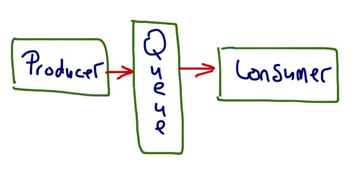

# Message Queue
# Requirement
To simulate a high-volume data input environment using the following technology stack
1. A message queue (choose an open-source message queue)
2. A NodeJS backend to push information into the queue (publish)
3. A NodeJS backend to read from the queue (subscribe) and to ​ filter out ​ certain
messages to be sent to the front end via Socket.IO
4. Any front end to receive the messages via Socket.IO and display
5. The publisher will publish 20 messages per second.
6. The NodeJS subscriber will filter for every priority >= 7 messages and push those messages into Socket.IO for the front end to display

## Structure
We have 3 NodeJs porject here, publisher/, consumer/ and frontend/

publisher pushes message to the queue, every 50 ms. 

When new messages are added to the queue, RabbitMQ notify the connected consumer.

when consumer handel the message it acknowledge back, and the message is removed from the queue

[image source](http://www.captaindebug.com/)

## Dependencies
- amqplib
- socket.io
- axios

## Using
1. Install and setup RabbitMQ.
2. run publisher 
3. run consumer (port 8080)
4. run frontend (port 8082)
5. http://localhost:8082

## External
[https://github.com/tanwanimohit/quotesapi](https://github.com/tanwanimohit/quotesapi)